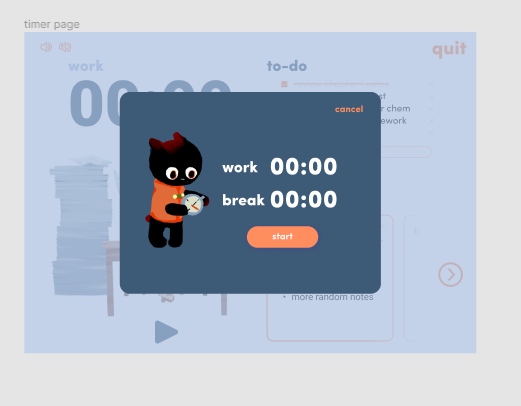

# Objective: Implement popup UI

## Todos:
- [ ] Get all the files needed for this UI(picture, animation, font...)
- [ ] Create the CSS styles for the component(try to use the ones already provided, and create ones that follows similar format)
- [ ] Make popup show hide animation
- [ ] Button should trigger the show hide animation
- [ ] the timer should be muatble(you can set the time on the timer)

## Due by the meeting on Monday:
- Get all the files needed for this UI(picture, animation, font...)
- Create the CSS styles for the component(try to use the ones already provided, and create ones that follows similar format)

