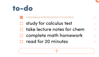

# Objective: Implement popup UI

## Todos:
- [ ] Get all the files needed for this UI(picture, animation, font...)
- [ ] Create the CSS styles for the component(try to use the ones already provided, and create ones that follows similar format)
- [ ] Create the object structure for Todo
- [ ] Create the UI for Todo
- [ ] The Todo should be rendered correctly with the given data
- [ ] Generate multiple todos according to the data(check out v-for)
- [ ] show different UI status(deletion line) according to todo data status(check out v-if)
- [ ] once you click the unchecked item, it should be checked, else otherwise

## Due by the meeting on Monday:
- Get all the files needed for this UI(picture, animation, font...)
- Create the CSS styles for the component(try to use the ones already provided, and create ones that follows similar format)
- Create the object structure for Todo

