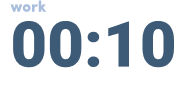

# Objective: Implement popup UI

## Todos:
- [ ] Get all the files needed for this UI(picture, animation, font...)
- [ ] Create the CSS styles for the component(try to use the ones already provided, and create ones that follows similar format)
- [ ] The time should be moving as the time passes(check out v-bind for vue)
- [ ] Create a function that mutates the time property on page(that is supposed to be binded with the timer ui. It takes a given time(e.g: startTimer(30) will result in a 30 seconds countdown), can check out setTimerInterval.
- [ ] the startTimer() function should `console.log("something");` once the time ended.

## Due by the meeting on Monday:
- Get all the files needed for this UI(picture, animation, font...)
- Create the CSS styles for the component(try to use the ones already provided, and create ones that follows similar format)

