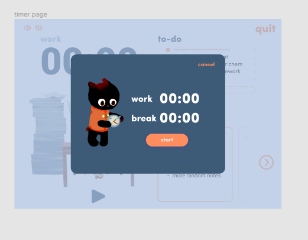

# Objective: Implement popup UI

## Todos:
- [x] Get all the files needed for this UI(picture, animation, font...)
- [x] Create the CSS styles for the component(try to use the ones already provided, and create ones that follows similar format)
- [x] Create basic elements with design
- [x] Create a form component

## Due by the meeting on Monday:
- Get all the files needed for this UI(picture, animation, font...)
- Create the CSS styles for the component(try to use the ones already provided, and create ones that follows similar format)

